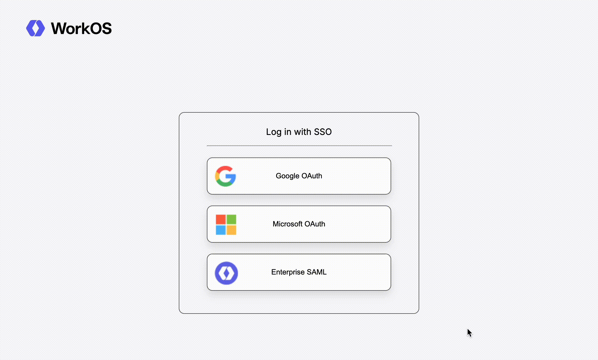
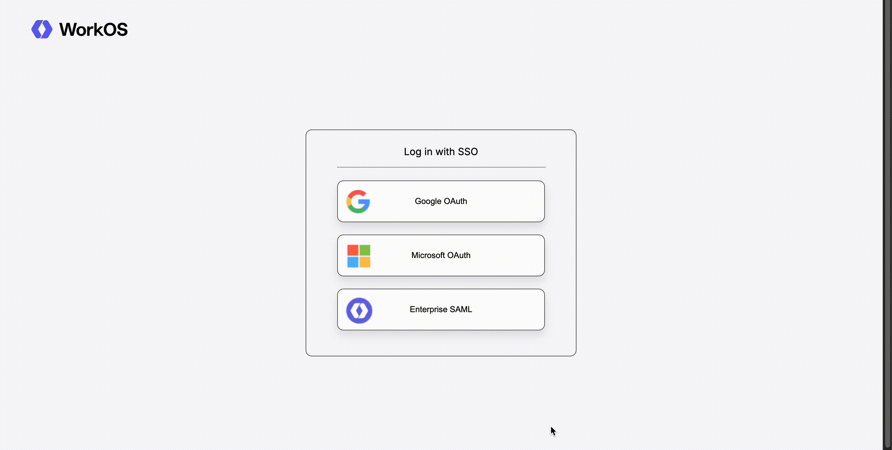
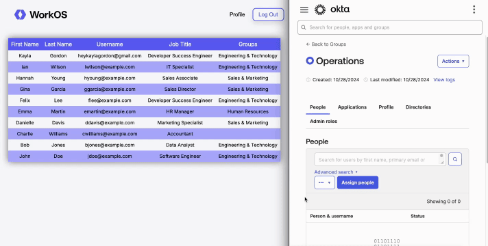

# Node.js App with SSO & Directory Sync

An example application demonstrating SSO and Directory Sync from WorkOS completed by Kayla Gordon.

## Deployed App

**To view the app in action, head to [https://workos-nodeapp.onrender.com/](https://workos-nodeapp.onrender.com/).**  

You should be able to:
1. Sign in using Google OAuth, Microsoft OAuth, or Enterprise SAML.
2. View a page that says "Hi [your name]!".
3. Click the "Directory" tab and see a list of users from a synced directory (through Okta).
4. Navigate back to the "Profile" page or log out.

## App Previews
**Sign In via Google:**  

  
<br />

**Sign In via Okta:**  

  
<br />

**App Displaying Okta Updates:**  



## Local Set Up

**Note: In order to run the app locally, you'll need Kayla's API Key and Client ID. Please let her know if you need those.**

1. Clone the main repo and install dependencies for the app you'd like to use:

    ```bash
    # HTTPS
    git clone https://github.com/kaylagordon/workos-nodeapp.git
    ```

    or

    ```bash
    # SSH
    git clone git@github.com:kaylagordon/workos-nodeapp.git
    ```

2. Install the dependencies:
    ```bash
    npm install
    ```

3. Once you've gotten the API Key and Client ID from Kayla, create a `.env` file at the project root, and store them like so:

    ```bash
    WORKOS_API_KEY=sk_xxxxxxxxxxxxx
    WORKOS_CLIENT_ID=project_xxxxxxxxxxxx
    ```

4. Start the server and head to http://localhost:8000/ to begin the login flow:

    ```sh
    npm start
    ```

## Other Info

### Branches
- The `main` branch can be used to run the app locally.
- The `production` branch is used for the deployed site (via [Render](https://docs.render.com/)). 